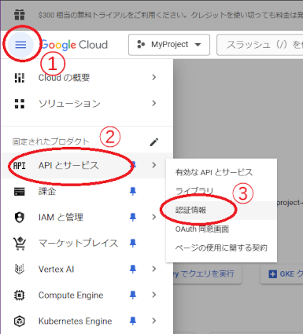

目次

1. [はじめに](#introduction)
1. [Google Cloudコンソールでの手順](#googlecloudconsole)
1. [Googleスプレッドシートでの手順](#googlespreadsheet)
1. [俺モニターでの手順](#oremonitor)

---

# はじめに
**俺モニター**がGoogleスプレッドシートを編集できるようにするために、**Googleサービスアカウント**を利用します。

大まかな手順の説明です。

1. **Googleサービスアカウント**を作成する（無料で作れます）
1. Googleスプレッドシート用のAPIを有効化する
1. **Googleサービスアカウント**の鍵を作成する
1. 作成した**Googleサービスアカウント**をGoogleスプレッドシートの共有ユーザーに追加する
1. **Googleサービスアカウント**の鍵を**俺モニター**に登録する

---

# Google Cloudコンソールでの手順

## Google Cloudコンソールにログイン
[Google Cloudコンソール](https://console.cloud.google.com/welcome)にGoogle個人アカウントでログインします。

## プロジェクトを作成
任意のプロジェクトを作成します。

## スプレッドシートAPIの有効化
プロジェクトのスプレッドシートAPIを有効化します。

### プロジェクトの選択
先ほど作成したプロジェクトを選択します。

### スプレッドシートAPIを探して有効化
プロジェクトの中からスプレッドシートAPIを探して有効化します。

## Googleサービスアカウントの作成
**俺モニター**に使わせる**Googleサービスアカウント**を作成します。

### サービスアカウントの作成

下の図では「参照者」を選択していますが「オーナー」でもOKです。「閲覧者」や「編集者」でも大丈夫かも知れません（詳しく分かっていません）。

### 鍵の作成とダウンロード
**俺モニター**に読み込ませるための鍵を作成します。

保存したファイルはパスワードが書かれたファイルのようなものなので、公開しないでください。後で**俺モニター**に読み込ませます。

後でGoogleスプレッドシートの共有設定で入力するので、メールアドレスを控えておきます。

---

# Googleスプレッドシートでの手順
Googleスプレッドシートを共有に設定し、**Googleサービスアカウント**を共有ユーザーに追加します。

## スプレッドシートを共有に設定する
任意のGoogleスプレッドシートを作成し、**俺モニター**と共有できるようにします。

## スプレッドシートのIDをコピーする
**俺モニター**に設定するために必要なスプレッドシートIDを控えておきます。

---

# 俺モニターでの手順

ダウンロードした鍵ファイルを**俺モニター**に登録します。

