---
title: 俺モニター
description: 俺モニターの説明書です。
---

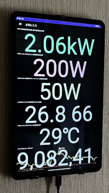
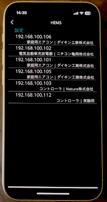
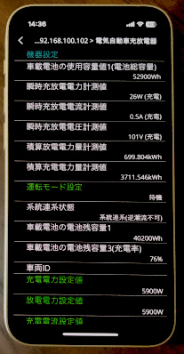
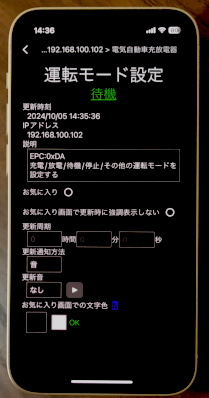

目次

1. [俺モニターで出来ること](#what)
1. [対応機種](#compatible)
1. [インストール](#install)
1. [通知について](#notification)
1. [ログイン画面](#login)
1. [サービス画面](#service)
1. [お気に入り画面](#favorite)
1. [自動化画面](#automation)
1. [設定画面](#settings)
1. [機器データの更新について](#update)
1. [Botについて](#bot)
1. [Googleサービスの認証について](#googleservice)
1. [ネットワークについて](#network)
1. [緊急起動モード（セーフモード）](#emergency_boot)
1. [クリップボード転送](#clipboard)
1. [動作確認済みAndroid端末](#confirmed-android)
1. [動作確認済み機器](#confirmed-device)
1. [免責事項](#disclaimer)
1. [既知の不具合](#known-issue)
1. [FAQ](#faq)
1. [ToDo](#todo)

{{ "now" | date: "%Y/%m/%d %H:%M" }} (UTC) 更新

---

# 俺モニターで出来ること
俺モニターは様々な機器のデータを読み取り、それらを監視することが出来ます。

## 出来ることの例
- 宅内のHEMS機器を検出してそれらの機器データを閲覧
- SwitchBot温湿度計の温度を常時表示(注[^NeedSwitchBotHub])
- スマートメーターの電力値を常時表示(注[^NeedNatureRemo])
- V2Hの充放電電力を常時表示
- V2Hに繋いでいるEVのバッテリー残量に変化があると内容を読み上げたりLINEで通知
- 翌日の日射量の予測値をLINEやSlackに毎日自動で投稿

<!--
- Discordチャットルームの古い会話を定期的に自動削除
- 太陽光の余剰電力が大きい時だけV2HでEVを充電(注[^NeedNatureRemo])
- ビットコインの値動きが激しくなると音で通知
- 各種機器データの情報を定期的に自動でメールで報告したりGoogleスプレッドシートに書き込む
-->

[^NeedSwitchBotHub]: 別途SwitchBotハブミニ等が必要
[^NeedNatureRemo]: 別途Nature Remo E lite等が必要

---

<a id="compatible"/>

# 対応OS

- Android
    - Android 5.0 (API 21 - Lollipop) 以降
- iOS/iPad
    - iOS 11 以降、iPadOS 13 以降
- Windows （※配布していません）
    - Windows 10 バージョン 1809 以降

---

# インストール
- Android版とiOS版がインストールできます
- 俺モニターはDeployGateアプリ経由で配信されます
    - Googl PlayストアやAppストアでは配信していません
- DeployGateの制限
  - 俺モニターをインストール可能な端末は全ユーザーで合計100台まで
  - 俺モニター作者はインストールされた端末の機種名やOSのバージョン番号が分かってしまいます
    - 分かるのは次の画像のような情報のみで、それ以外の情報を知ることは出来ません

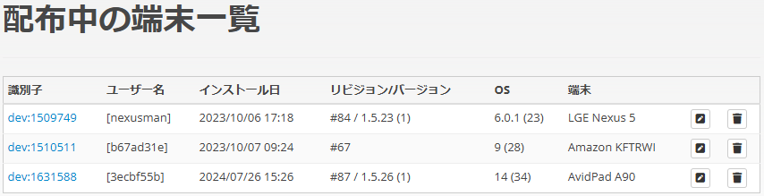

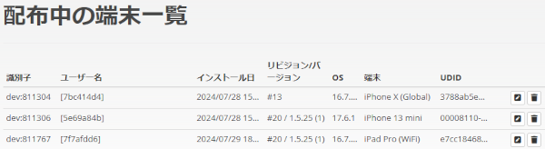

## インストール手順
下記の俺モニター用[DeployGateインストールページ](#deploygate_url)を開き、

1. DeployGateのインストール
    1. アカウント作成は不要です
1. 【iOS版のみ】自身のiOS端末に対応したバージョンの俺モニターが配信されるのを待つ。詳細はこちら → [iOS版で追加となる手順](#deploygate_ios)
1. 俺モニターのインストール

の順に行います。

<a id="deploygate_url"/>

### DeployGateインストールページ
- Android版
	- [https://dply.me/ouhblz](https://dply.me/ouhblz)
- iOS版
	- [https://dply.me/jz8qlh](https://dply.me/jz8qlh)

<a id="deploygate_ios"/>

### iOS版で追加となる手順
「俺モニターをインストール可能なiOS端末の情報」が俺モニター自身に書き込まれているため、書かれていない端末では起動しません。従って、以下の手順が必要になります。

1. DeployGateのインストール中に、インストールしようとしているiOS端末のUDID（シリアル番号のようなもの）が俺モニター作者に送信されるのを許可します
    1. この時の日時をメモしておいてください
1. 【俺モニター作者の作業】端末情報(UDID)を追記した俺モニターを作り、更新バージョンとしてアップロードします
    1. 更新履歴に「〇月〇日〇時〇分までにリクエストされたUDIDがインストール可能です」と残します
1. 自身の端末情報が追記された俺モニターのアップデートが来るのを待って（早くて数時間、遅いと1～2日）インストールします

また、インストールする端末の開発者モード（デベロッパモード）を有効化する必要があります。

- 端末の設定アプリ＞プライバシーとセキュリティ＞画面一番下までスクロール＞デベロッパモード＞オン

---

# 通知について
機器データが更新されたことや自動処理に関する情報などをユーザーに通知することが出来ます。

- 通知の種類は、端末音によるものとLINE,Discord,Slackへの投稿によるものがあります
- LINEへの通知を行う手順は[こちら](linenotify.html)で説明しています
    - LINEへの通知は2025年4月からは使用できなくなります

## 通知の例
- 「ピロリーン」のような端末音
- 「〇〇の機器データが△△から□□に更新されました」のような文章をLINEやDiscordに投稿

### 端末音について
- 機器データごとに音の種類を選択できます
- 数値に関する機器データ（温度やバッテリー残量など）には、数値の上昇と下降で個別に音を選択できます

### 投稿について
- LINE Notify、Discord WebhookまたはSlack Incoming Webhooksを使用して通知文を投稿します
- 俺モニターの設定画面でLINE NotifyやDiscord Webhookの設定を行っていない場合は投稿されません

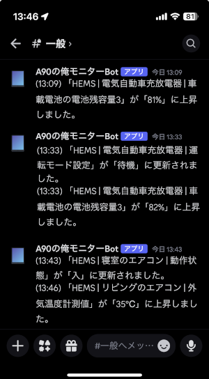

---

# ログイン画面
ログイン画面に入ると自動的に[Bot](#bot)がサーバーにログインします。

- 俺モニターの設定画面で[Bot](#bot)の設定を行っていない場合、ログインは行われません

---

# サービス画面
機器データを閲覧することができるサービスが並ぶメニュー画面です。

- 各サービス内の一部の画面は、画面を下に引っ張って閲覧データを更新でます
    - Windows版はマウスの右クリックメニューで操作します

以下のサービスがあります。

## HEMS サービス
HEMS機器の検出と機器データの閲覧を行うサービスです。

- 読み取り可能および書き込み可能な機器データ（ECHONETプロパティ）を一覧表示します
    - 俺モニターが対応していない機器データは[Not yet]に続く16進数の数字で表示されます
- 一部の機器データは書き込み（設定変更）に対応しています

>書き込みは次のようなリスクがあります
>
>- リモコンや機器のボタン等で操作できない設定項目を触ると、機器の誤作動になりかねません（最悪、故障）
>- 変更前の設定値を忘れると元に戻せなくなります
>- リモコンや機器のボタン等でユーザーが操作可能な項目は、書き換えを行っても安全と考えられます

### 必要なもの
- HEMS対応機器

### ECHONET Lite について
- 俺モニターはIPv4およびUDPを使用してECHONET Lite機器との通信を行っています

## Nature Remo サービス
Nature Remo機器を通してスマートメーターのデータを閲覧するサービスです。

### 必要なもの
- Nature Remo E lite 本体
    - Nature Remo Eシリーズの機種に対応しているつもりですのでlite以外も使えるかも知れません（未確認）
- Bルートサービスの申し込み
    - 電力会社（送配電会社）の提供するBルートサービスの手続きが必要です
    - 手続き後にNature Remoアプリに自宅のスマートメーターを登録します

## SwitchBot サービス
SwitchBot機器のデータを閲覧するサービスです。

### 必要なもの
- SwitchBot 温湿度計等
    - 温湿度機能を持っているSwitchBot機種に対応しています
    - 各温湿度計はSwitchBotアプリでクラウドサービスを有効化しておくこと
- SwitchBot ハブシリーズ
    - クラウドサービスに必要です

## チャート サービス
仮想通貨取引所の各銘柄の価格チャートを閲覧するサービスです。

- お気に入りに設定したチャートはリアルタイム取引データを受信し続けます
    - ただし、更新周期が0秒の場合は受信しません
- リアルタイム取引データがチャートに反映されるのは、そのチャートに設定した更新周期のタイミングとなります
- 取引量の多い銘柄はリアルタイム取引データの通信量も多くなり、チャートアイテムの更新周期に関係なく俺モニターの処理負荷が増えます
- 端末のスリープ中など俺モニターが表示されていない間は通信を一時停止します
- 端末の通信状態によってはリアルタイム取引データの通信が切断されることがあります
    - 切断があれば音および投稿で通知し、少し時間をおいて自動的に再接続が行われます

---

# お気に入り画面
お気に入りに設定した機器データ（機器アイテムとも呼びます）を大きな文字で表示します。

- サービス画面で閲覧した機器データ情報よりもコンパクトな情報で表示されます

## お気に入りの設定方法
1. 各サービス画面で機器アイテムを選択してアイテム詳細画面を表示します
1. アイテム詳細画面で「お気に入り」にチェックを入れると、お気に入り画面に表示されるようになります

## 自動更新
必要に応じてお気に入りアイテムの更新周期を設定することで、「[お気に入りアイテムの更新](#favoriteitemsupdate)」自動化によって自動更新されます。

## お気に入りの削除
- アイテム詳細画面で「お気に入り」のチェックを外すと、お気に入り画面から削除されます
- お気に入り画面でアイテムを右にスワイプしても削除することが出来ます
    - Windows版はマウスの右クリックメニューで操作します

## 一斉更新
- お気に入り画面を下に引っ張っることで、全てのお気に入りアイテムが最新の状態に更新されます
    - Windows版はマウスの右クリックメニューで操作します

## 並び替え
1. お気に入りアイテムを長押します
1. 移動したい位置にドラッグして指またはマウスを離します

---

# 自動化画面
自動処理を行うアイテムが並ぶメニュー画面です。

- 最初に自動化アイテム「お気に入りアイテムの更新」が表示されます
- その他の自動化アイテムは画面下の「追加⊕」を使ってメニューに追加します
- 一部の種類を除き、同種の自動化アイテムを複数作ることが出来ます
- 追加した自動化アイテムは右スワイプ動作で削除できます
    - Windows版はマウスの右クリックメニューで操作します
- 自動化アイテムは、端末のスリープ中など俺モニターが表示されていない間は基本的に動作を停止します
    - Windows版では俺モニターを最小化している時が俺モニターのスリープ中に相当します
    - Android版とWindows版では、実行日時の指定可能な自動化アイテムは端末のスリープ中など俺モニターが非表示中であっても実行される場合がありますが、指定した日時ちょうどに実行されるとは限りません
        - (例) 日射量予測、Discordチャンネルの投稿文削除、定期報告
    - iOS版およびAndroid版では、俺モニターが画面に表示されていない時にOSによって俺モニターが強制終了される場合があります

以下の自動化アイテムがあります。

- [お気に入りアイテムの更新](#favoriteitemsupdate)
- [読み上げ](#speech)
- [ダッシュボード](#dashboard)
- [日射量予測](#solarradiationprediction)
- [Discordチャンネルの投稿文削除](#discordmessagesdelete)
- [PV余剰充電](#pvsurpluscharge)
- [価格変動警報](#volatilityalert)
- [定期報告](#periodicreport)
- [V2H充放電記録](#v2hchargedischargerecord)

## お気に入りアイテムの更新
### 自動化内容
- お気に入りアイテムを、それぞれのアイテムに設定されている更新周期で自動更新します
    - 更新周期が0秒に設定されているアイテムは、お気に入り画面に表示されるだけで自動更新されません

## 読み上げ
### 自動化内容
- 指定したお気に入りアイテムの値が変更されると端末からの音声で内容を読み上げます
- 音声の種類
    - 端末の標準機能による音声合成
    - Azure AI Speechサービスによる音声合成

### 必要なもの
- Azure AI Speechを使う場合
    - Microsoft Azureアカウントを作成し（無料アカウントでOK）、AI Speech（AI音声）の利用設定を行います
    - Azure AI Speechの価格オプションでFree(F0)を選択することで無料の範囲内で利用できます
    - 俺モニターでAzure AI Speechの設定を完了する
        - 設定＞読み上げ＞Azure AI Speech

## ダッシュボード
### 自動化内容
- お気に入りアイテムのデータを外部のダッシュボードサービス（[Ambient](https://ambidata.io/)）に送信して、データのグラフ化を可能にします
- 値が数値で表される機器アイテムのみ使用できます
    - 温度、電力などが使用できます（kW、℃などの単位が含まれていてもOK）
    - 運転モード、電源ON/OFFなどの値は数字ではないため使用できません
- 俺モニター内でグラフ表示は行いません
- [Ambient](https://ambidata.io/)には1チャネルあたり1日3,000件までデータを登録できます。平均すると28.8秒に1件のペースです

### 必要なもの
- [Ambient](https://ambidata.io/)でアカウントを作成し（無料アカウントでOK）、チャネル作成やボード作成を行います

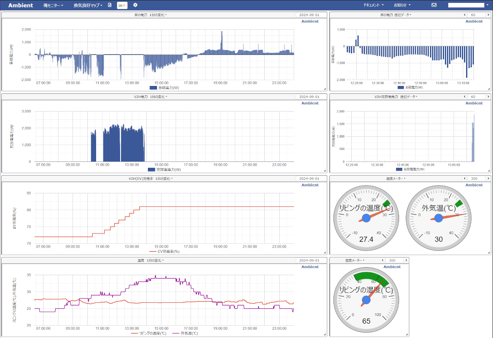

## 日射量予測
### 自動化内容
- 定期的に[日射量 ひまわり予報](https://www.amecs.co.jp/solar/index.html)のサイトから予測データを取得してLINEやDiscordへ投稿します
- 俺モニターの「設定＞位置情報」で設定された地理座標の予報データを取得します

### 必要なもの
- 俺モニターでLINE Notify、Discord WebhookまたはSlack Incoming Webhooksのいずれかの設定を完了する（複数設定しても可）
    - 設定＞通知＞LINE Notify
    - 設定＞通知＞Discord Webhook
    - 設定＞通知＞Slack Incoming Webhooks

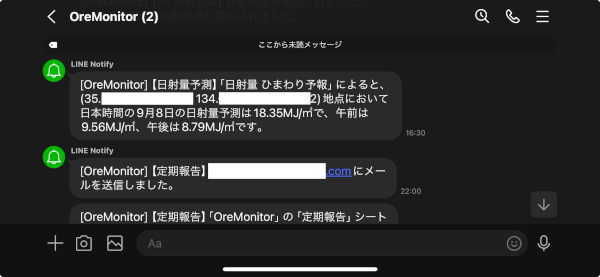

## Discordチャンネルの投稿文削除
### 自動化内容
Discord Botが参加しているDiscordサーバーの古い投稿を定期的に削除します。

### 必要なもの
[Botについて](#bot) にてBotを動作させておく必要があります。

### 削除権限について
- Botが投稿文を削除するためには、Discordのチャンネル設定でBotに「メッセージの管理(Manage Messages)」の許可を与える必要があります
- 投稿を削除されたくないチャンネルには許可を与えないようにします

## PV余剰充電
### 自動化内容
- 電気自動車充放電器(V2H)の運転モードを制御して、余剰電力が大きい時にPV余剰充電を行います
- お気に入りアイテムから供給されたデータを使い制御を行います
    - 必要なデータの1つでも供給が停滞すると自動処理を停止します
- グリーンモードの場合は余剰電力があまり大きくなくても充電が行われるためその場合は変換効率が悪くなってしまいますが、この自動化は変換効率を高くすることを目的にしています

### 必要なもの
- V2H機器
    - PV余剰充電機能を有効化しておくこと
- V2Hに接続する電気自動車
- 太陽光発電の設備
- スマートメーターに接続したNature Remo E lite
    - 他のNature Remo機器でも動作する可能性がありますが未確認です

### 使用上の注意
>- この自動化処理はV2Hを操作するため、V2Hの操作が衝突しないようにV2Hのタイマー設定は解除しておいた方が無難です
>    - ただし、俺モニターからのV2H操作は「HEMS操作」扱いになるため、未確認ですが、HEMS操作による充放電中はV2H機器のタイマー動作は実行されないと思われます
>- タイマー放電中およびグリーンモード中においても、この自動制御は動作します（乗っ取ります）
>- タイマー充電中や手動充電中は乗っ取りません

### V2H機器の制御について
次のような制御を行っています。

- V2Hが待機モードの時に余剰電力が大きくなる → V2Hを放電モードに変更します
    - PV余剰充電機能が有効化されていれば放電モードであっても充電動作となります
- V2Hが放電モードの時に余剰電力が小さくなる → V2Hを待機モードに変更します

その他に、

- 余剰電力が「大きくなる」「少なくなる」の判断は、余剰電力値の推移から求めた標準偏差や平均値を組み合わせた方法で行います
- グリーンモード同様に、余剰電力の変動が大きいと放電から待機モードへの切り替えが間に合わなくなることにより、EVから家への給電が発生する場合があります
- この自動化の制御パラメータが初期設定の状態では、余剰電力の変動が大きいほど運転モードの切り替えが発生しにくく、グリーンモードよりも粘ります（EVパワー・ステーションとの比較）
- 動作条件には「最低充電率」「上限充電率」「直近12時間での上限充電回数」が設定できます
    - 下の画像は「直近10時間」になっていますが、最新版は12時間です

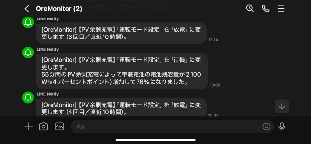

## 価格変動警報
### 自動化内容
- 指定した銘柄の価格を監視して、価格変動が大きくなると通知を行います
- 音による通知はその都度行われますが、投稿による通知は一度切りです

## 定期報告
### 自動化内容
- 機器データを定期的に収集して、メールでの送信やGoogleスプレッドシートへの書き込みを行います

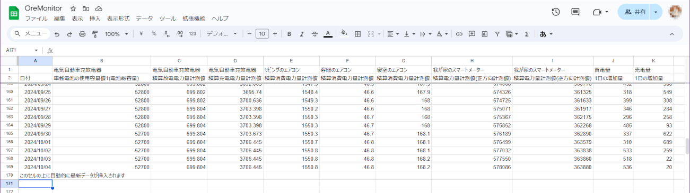

### 必要なもの
- メールで報告を送信する場合
    - 任意のメールアドレスを持っていること
    - そのメールのSMTP設定情報（サーバー、ポート番号など）を俺モニターの「設定＞メール」メニューにて設定します
- Googleスプレッドシートに書き込みを行う場合
    - [Googleサービスの認証について](#googleservice)の設定を行う
    - 共有に設定したGoogleスプレッドシートを用意する

<a id="v2hchargedischargerecord"/>

## V2H充放電記録

>V2H充放電記録は作成途中のため現在は使用できません。

### 自動化内容
V2Hの充放電開始と終了時に以下の電力を記録します。
- 積算充電電力量計測値
- 積算放電電力量計測値
- 車載電池の電池残容量 1

これにより以下の値が計算できます。
- 車載電池容量の増減
- 充放電の損失（全体平均、単位時間平均）

### 記録について
- 記録したデータは端末に保存されます
- 端末に保存された記録データは手動でCSV形式でファイルに書き出したり、Googleスプレッドシートに書き込むことが出来ます
- ただし、車載電池の電池残容量の取得値は精度が高くないため、V2H充放電記録を積み重ねる必要があります

### 必要なもの
- V2H機器
- V2Hに接続する電気自動車

---

# 設定画面
俺モニターの各種設定を行います。

---

# 機器データの更新について
## 一斉更新
- スリープからの復帰時など、俺モニターが再表示された時に自動的に全てのお気に入りアイテムが一斉に更新されます
- アイテムが一斉に更新されると、それぞれのアイテムの更新タイミングが揃いやすくなり、通信量とアクセス回数が最適化されます
- 俺モニター起動時のお気に入りアイテム復元時も、更新タイミングが揃った状態になっています

## HEMS機器
- HEMS機器は自発的にアイテムの情報を通知してくる場合があります
    - （例）電源ON/OFFの変更、V2Hの運転モードの変更
- ただし、HEMS機器が自発的に通知してくる情報は取りこぼす可能性があります（UDP通信の仕様）

## Nature Remo / SwitchBot
- HEMS機器と異なり、俺モニターはNature RemoおよびSwitchBotの機器には直接アクセスしていません。それぞれのクラウドサービスから機器データを取得しています
- そのため、取得した機器データは数十秒程度遅れた情報となります

---

# Botについて
チャットを通して俺モニターと対話を行うことが出来ます。

## 出来ることの例
- 挨拶とバージョン番号を表示する
- 全V2H機器の最新の状態を表示する
- スケジュールの一覧を表示する
- お気に入りアイテムを表示する
- V2H機器の運転モードを充電に設定する
- 任意の文章を読み上げる（俺モニターが喋ります）

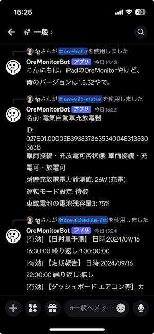

## Botの動作について
- 基本的に、俺モニターが画面に表示されている間のみBotが動作します
- Android版およびWindows版では端末のスリープ中など俺モニターが非表示の時もBotが動作している場合があります
    - 非表示中のアプリはOSによって強制終了されることがあるため、そうなった場合は動作しません

## 必要なもの
- Discordのアカウント（無料アカウントでOK）
- DiscordのWebサイトでDiscord Botのアカウントを作成しアクセストークンを取得する（無料で出来ます）
- 俺モニターの「設定＞Bot＞Discord Bot」メニューで設定を完了する

これらが揃ってから俺モニターのログイン画面を開くと、俺モニター内でBotが起動しDiscordにログインします。

その後、Discordの招待リンクなどを使い、BotをDiscordサーバーに招待します。

## Botアカウントについて
- このBotは俺モニターの中で動作するため、基本的に、俺モニターをインストールする端末ごとにBotアカウントが必要になります
- 1つのBotアカウントを複数の俺モニターで共有することも可能ですが、Botが同時ログインすることは出来ないため、最後にログインしたBot以外はログアウトします

---

# Googleサービスの認証について

Googleスプレッドシートの読み書きなど、Googleサービスを使用するためには以下のいずれかの認証を行います。

## Googleサービスアカウントによる認証
Googleサービスアカウントを使用してGoogleサービスにアクセスします。

- 詳しい手順説明へのリンク
    - [スプレッドシートを編集できるようにする](googleserviceaccount.html)
- 上記リンクの概要
    - Googleサービスアカウントを[Google Cloudコンソール](https://console.cloud.google.com/welcome)で作成します（無料で作成できます）
    - 作成したサービスアカウントのメールアドレスは後で必要になるので控えておきます
    - サービスアカウント作成画面の「鍵を追加」でダウンロードしたファイルを俺モニターで読み込みます
        - 読み込んだ鍵の内容は暗号化して端末に保存されますが、バックアップされません

## Google OAuthによる認証
個人のGoogleアカウントを使用してGoogleサービスにアクセスします。

>この認証方法は**Googleサービスアカウント**よりも手軽に利用できるため試用には向いていますが、有効期間が7日間という制限があるため、長期利用は推奨しません。

- 俺モニターの作者に自身のGoogleアカウント（GMailアドレス）を連絡します
    - 俺モニター作者の連絡先メールアドレスは、俺モニターの「設定＞認証＞Google OAuth＞認証」メニューの認証ボタンを押して、切り替わったブラウザに表示される「OreMonitor」のリンクをクリックすると表示されます
- 俺モニター作者によってOAuth認証可能なユーザとして登録されるのを待ちます
- 俺モニターの「設定＞認証＞Google OAuth」メニューにて認証を完了させます

### OAuth認証での制限事項
このアプリはGoogleへのアプリ申請を行っていないため、以下の制限があります。
- 登録されたGoogleアカウントだけがOAuth認証を使用することが出来ます
    - 登録作業は俺モニター作者が行います（手間ではありません）
- 認証の有効期間は7日間のため、継続して利用するには繰り返し再認証の操作（俺モニターの「OAuth認証」メニューで解除→認証を行う）が必要になります
- 認証可能な端末数は全ユーザーで合計100台まで

### OAuth認証での注意点
- 俺モニターの「Google OAuth」メニューにて認証プロセスを実行するとWebブラウザに切り替わりますが、ブラウザの種類によっては認証プロセスが完了しない場合があります
    - Amazon Fire系タブレットの場合はChromeブラウザを使うことで認証プロセスが完了しますが、標準ではChromeブラウザがインストールされていないため、事前にChromeブラウザをインストールしておく必要があります

---

# ネットワークについて
- HEMS機器とはローカルエリアネットワーク経由で直接アクセスを行います
- Nature Remo機器、SwitchBot機器およびチャートのデータはインターネット経由で取得します
    - Nature Remo機器とSwitchBot機器のデータについては数十秒程度過去の情報となるため、リアルタイム性は高くありません

---

# 緊急起動モード（セーフモード）
俺モニターが起動しないなど不測の事態が起きた時に、起動できる可能性が高い起動方法です。

- 稀に、端末を再起動すると解決する場合があります
- これらの方法を試しても解決しない場合は、俺モニターの再インストールが必要になります

## 操作方法
1. 端末のホーム画面に置かれた俺モニターアイコンを長押しする
1. 表示されるメニューの「緊急起動モード」を選択する

<!--
- 端末の機内モードがONの状態で俺モニターを起動すると、以下の状態で始まる緊急起動モードとなります
-->

## 状態
緊急起動モードでは以下の状態になります。

- 起動時のお気に入りアイテム復元OFF
- 全ての自動処理がOFF
- スケジュール処理がOFF（日時指定で動作する機能のこと）
- タイトル画面が表示される
- 画面上部のナビゲーション文字が赤色で表示される

## バックアップ
緊急起動モードで起動してすぐに「設定＞バックアップ」メニューで書き出しを行えば、緊急起動モード前の状態の設定が書き出されます。

その後、俺モニターを再起動すれば、お気に入りアイテムや自動処理のON/OFF状態やスケジュール処理は元に戻ります。

## 注意
一度緊急起動モードにすると、俺モニターを終了させない限り緊急起動モードは解除できません。

ただし、手動で自動化アイテムをONにすることは出来ます。

---

# クリップボード転送
クリップボードにコピーされているテキストを他の俺モニターに転送します。

## 操作方法
1. 端末のホーム画面に置かれた俺モニターアイコンを長押しする
1. 表示されるメニューの「クリップボード転送」を選択する

## 処理内容
- 端末のクリップボードにコピーされているテキストを、ローカルネットワーク内で起動している全ての俺モニターに転送します
- 転送先の俺モニターでは、受け取った瞬間にその端末のクリップボードにコピーします

## 注意点
- 「クリップボード転送」を選択してから0.5秒以内に応答しなかった俺モニターには転送されません
- 非表示中の俺モニターは応答できない又は応答に間に合わない可能性が高くなります

---

<!--

# 使用期限について
- 俺モニターに重大な不具合（機器に損傷を与えるような不具合）が発覚した場合に、それを知らないまま使い続けることを防ぐための制限です
- 初回起動の30日後に最初の使用期限が設定されます
- 使用期限を延長するライセンスコードを入手し設定することで期限が延長されます
- 重大な不具合の対策バージョンをインストールすることでも期限を延長できるようになります
- ライセンスコードは、インストールされた全ての俺モニターに適用できる共通のコードになっており、適宜発行します
    - 古いバージョンの俺モニターには適用できないようにすることも可能です（重大な不具合が発生したバージョンを使えなくするため）
- 新しいライセンスコードを設定せずに期限後も使いたい場合は俺モニターを再インストールしてください
    - 俺モニター内で設定した各種設定が全て消えてしまいますが、新たに30日間の使用期限が設定されます
- 使用期限のチェックは俺モニターの起動時に行っているため、俺モニターを再起動しない限り期限後も使い続けることは可能です

---

-->

# 動作確認済み端末
- Android
    - LG Nexus 5 / 5X
        - 5は最近バッテリーが膨らんで本体カバーが割れてしまったため今後動作確認は出来なくなります
    - Amazon Fire HD 10 (KFTRWI)
    - AvidPad A90
- iOS
    - iPhone X
    - iPhone 13 mini
    - iPad Pro 12.9インチ（第1世代）

---

# 動作確認済み機器
- (ニチコン) EVパワー・ステーション VCG-666CN7（プレミアムモデル）
- (ダイキン) ルームエアコン ATR36YSE9-W 他ATF系
- (シャープ) ドラム式洗濯乾燥機 ES-W113
- Nature Remo E lite
- SwitchBot 温湿度計
- SwitchBot 温湿度計プラス

---

# 免責事項
俺モニターを使用することに関して発生した損害については、作者は一切責任を負いません。

Botを使用したHEMS機器の遠隔操作については、ECHONET Lite規格における遠隔操作での指針によって推奨されている公衆回線経由の制御手順を踏んでいません。
そのため、公衆回線経由で制御されたことをHEMS機器側が識別していない状態での制御となるため、公衆回線経由での制御に対する安全機能がHEMS機器に備わっていた場合に働かないことが想定されます。

簡単に述べると、Botを使ったHEMS機器の遠隔操作はリスクがあると言うことです。

---

# 既知の不具合

> ~~iOS版では、お気に入り画面のアイテムを一番上に移動させる機能を有効にすると、アイテムが移動した瞬間に俺モニターが強制終了することがあります。 
>修正されるまで、iOS版では「設定＞お気に入り＞アイテムの移動」の機能の使用は控えてください。~~

- 読み上げ
    - 標準機能
        - iOS版は音声の名前を指定しても音声が変わらない
            - 常に言語ごとのデフォルト音声で発音されてしまう
        - Amazon Fireタブレットでは読み上げ自体が出来ない
- チャートの更新停止
    - 端末のスリープ解除後や取引所のメンテナンス再開後に、チャートが更新されなくなることがある
- ダッシュボード
    - 俺モニターが非表示になる際、溜まっている未送信データを即時送信しようとするが失敗することがある
    - Android OSのバージョンがかなり古い端末では、Ambientへのデータ送信に失敗し「Connection failure」と通知される
- PV余剰充電
    - EVが満充電近くになると車両が充電電力を絞るため、余剰電力が下がったと俺モニターが誤判断して待機モードに切り替わりやすくなる
        - 100%までPV余剰充電できなくはないですが、上限充電率は100%を避けた方が良いかも知れません
- HEMS機器のIPアドレス更新
    - 俺モニター動作中にHEMS機器を物理的に追加・切断した場合やルーターの再起動などによってHEMS機器のIPアドレスが変更された場合は、機器アイテムの状態が更新されなくなくなる
        - そうなった場合は俺モニターを再起動する必要があります
- アプリの外観（明るい／暗い）
    - 外観の設定を変更すると、再起動するまで正しく反映されない画面があるかも知れない
        - 変更後は俺モニターの再起動を推奨
- ピッカー（選択肢のユーザーインターフェース）
    - iOS版はピッカー幅が固定されてしまっているため、長い文字の選択肢を選ぶと表示が見切れてしまう
- ハングアップ
    - アプリ起動時のお気に入りアイテム復元中に俺モニターがハングアップすることがある
    - 端末のスリープ解除時や、他の画面から俺モニターに切り替えた時に俺モニターがハングアップすることがある

---

# FAQ
- Android版がインストールできない
    - 端末に複数のアカウントを作っている場合に、別のアカウントでインストールした古い俺モニターが残っているとインストールに失敗することがあります
- 俺モニターが起動しない
    - [緊急起動モード](#emergency_boot)を試すと起動できる可能性が高いです
    - 俺モニターの「設定＞開発用＞appsettings.jsonの作成」で作成したファイルがある場合は削除してみる
    - インストールしてから一度も起動しない場合は、俺モニター作者のほうで調査が必要です

---

# ToDo
- やりたい
    - [ ] メニュー
        - [ ] 深い階層からトップページに戻るボタン等が欲しい（UIを思いついていない）
    - [ ] 読み上げ
        - [ ] 読み上げる値の刻みを変えたい
            - 0～10まで1刻みで読み上げるのではなく、0,5,10のみ読み上げるなど
        - [ ] Alexaで読み上げたい
            - 調べた限り無理っぽい
    - [ ] 価格変動警報
        - [ ] 取引量に応じて通知音量を変えたい
    - [ ] チャート
        - [ ] bitfinex,bitbank,coincheckに対応する
        - [ ] お気に入り画面では、グラフを重ねずテキストのみの表示にするオプションが欲しい
    - [ ] PV余剰充電
        - [ ] 制御パラメーターをBotで変更できるようにしたい
        - [ ] 制御パラメーターを複数セット持てるようにしたい
        - [ ] バッテリー残量が少ない時と多い時で自動で制御パラメータを変えたい
        - [ ] PV余剰充電の自動化がOFFの時はV2Hのお気に入りアイテムの自動更新をストップしたい
            - [ ] コネクタロックも解除したい（解除からの自動復帰も）
- やりたくない
    - [ ] iOS版でスリープ中でも自動化アイテムのスケジュール動作を実行できるようにする
        - サイレントプッシュ通知（リモート通知）を使えば実現可能
    - [ ] チャートのローソク足表示
        - 今のところ必要性を感じていない
    - [ ] SwitchBot機器データの取得をBLE(Bluetooth Low Energy)で行う
        - 挑戦したが苦労しそうなので諦めた
        - Amazon Fire HD 10では何故か全く取得できない
    - [ ] Wi-SUN機器をAndroid端末にUSB接続してスマートメーターの電力値を読み取る
        - 実現すれば遅延が無くなる大きなメリットがあるが、ハードも必要だし・・・

---
