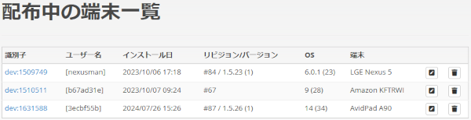

目次

1. [**俺モニター**で出来ること](#what)
1. [インストール](#install)
1. [通知について](#notification)
1. [ログイン画面](#login)
1. [サービス画面](#service)
1. [お気に入り画面](#favorite)
1. [自動化画面](#automation)
1. [設定画面](#settings)
1. [Botについて](#bot)
1. [ネットワークについて](#network)
1. [緊急起動モード（セーフモード）](#emergency_boot)
1. [動作確認済みAndroid端末](#confirmed-android)
1. [動作確認済み機器](#confirmed-device)
1. [免責事項](#disclaimer)
1. [既知の不具合](#known-issue)
1. [ToDo](#todo)

---

# **俺モニター**で出来ること
## 出来ることの例
- 宅内のHEMS機器を検出してそれらの機器データを閲覧
- SwitchBot温湿度計の温度を常時表示(注[^NeedSwitchBotHub])
- スマートメーターの電力値を常時表示(注[^NeedNatureRemo])
- V2Hの充放電電力を常時表示
- V2Hに繋いでいるEVのバッテリー残量に変化があると音やLINEで通知
- 太陽光の余剰電力が大きい時だけV2HでEVを充電(注[^NeedNatureRemo])
- ビットコインの値動きが激しくなると音で通知
- Discordチャットルームの古い会話を定期的に自動削除
- 各種機器データの情報を定期的に自動でメールで報告したりGoogleスプレッドシートに書き込む
- 翌日の日射量の予測値をDiscordやLINEに毎日自動で投稿する

[^NeedSwitchBotHub]: 別途SwitchBotハブミニ等が必要
[^NeedNatureRemo]: 別途Nature Remo E lite等が必要

---

# インストール
- **俺モニター**はDeployGateアプリ経由で配信されます
- Android版とiOS版があります
- DeployGateの仕様上、**俺モニター**作者はインストールされた各端末の機種名やOSのバージョン番号が分かってしまいます
    - それ以外の情報を知ることは出来ません（個人情報などはもちろん分かりません）

## インストール手順
下記の**俺モニター**用DeployGateインストールページを開き、

1. DeployGateのインストール
1. 【iOS版のみ】自身のiOS端末に対応した**俺モニター**が配信されるのを待つ
1. **俺モニター**のインストール

の順に行います。

### DeployGateインストールページ
- Android版
	- [https://dply.me/ouhblz](https://dply.me/ouhblz)
- iOS版
	- [https://dply.me/jz8qlh](https://dply.me/jz8qlh)

### iOS版で追加となる手順
"**俺モニター**をインストール可能なiOS端末の情報"が**俺モニター**自身に書き込まれているため、以下の手順が必要になります。

1. DeployGateのインストール中に、インストールしようとしているiOS端末の情報（シリアル番号のようなもの）が**俺モニター**作者に送信されるのを許可します
1. （**俺モニター**作者が、端末情報を追記した**俺モニター**を作り、更新バージョンとしてアップロードします）
1. 自身の端末情報が追記された**俺モニター**のアップデートが来るのを待って（早くて数時間、遅いと1～2日は掛かります）インストールします

また、インストールする端末の開発者モード（デベロッパモード）を有効化する必要があります。

- 端末の設定アプリ＞プライバシーとセキュリティ＞画面一番下までスクロール＞デベロッパモード＞オン

---

# 通知について
機器データが更新されたことや自動処理に関する情報などをユーザーに通知することが出来ます。

通知の種類は、端末音によるものとLINEやDiscordへの投稿によるものがあります。

## 通知の例
- 「ピロリーン」のような端末音
- 「〇〇の機器データが△△から□□に更新されました」のような文章をDiscordやLINEに投稿

### 端末音について
- 機器データごとに音の種類を設定できます
- 数値に関する機器データ（温度やバッテリー残量など）には、数値の上昇と下降で個別に音を設定できます

### 投稿について
- Discord WebhookやLINE Notifyを使用して通知文を投稿します
- **俺モニター**の設定画面でDiscord WebhookやLINE Notifyの設定を行っていない場合は投稿されません

---

# ログイン画面
ログイン画面に入ると自動的に[Bot](#bot)が各サーバーに入室します。

- **俺モニター**の設定画面で[Bot](#bot)の設定を行っていない場合、ログインは行われません

---

# サービス画面
機器データを閲覧することができるサービスが並ぶメニュー画面です。

- 各サービス内には、画面を下に引っ張って閲覧データを更新する機能に対応した画面があります
    - Windows版はマウスの右クリックメニューで操作します

以下のサービスがあります。

## HEMS サービス
HEMS機器の検出と機器データの閲覧を行うサービスです。

- **俺モニター**作者が所有している機器については、完全ではありませんが詳細な機器データの情報が閲覧できます
- **俺モニター**作者の所有していない機器は簡易的な情報が閲覧できます
- 一部の機器データは設定変更に対応しています

### 必要なもの
- HEMS対応機器

### ECHONET Lite について
- **俺モニター**はIPv4およびUDPを使用してECHONET Lite機器との通信を行っています

## Nature Remo サービス
Nature Remo機器を通してスマートメーターのデータを閲覧するサービスです。

### 必要なもの
- Nature Remo E lite 本体
    - liteでなくてもNature Remo Eシリーズの機種に対応しているつもりですが、未確認です
- Bルートサービスの申し込み
    - 電力会社の提供するBルートサービスの手続きが必要です
    - 手続き後にNature Remoアプリに自宅のスマートメーターを登録します

## SwitchBot サービス
SwitchBot機器のデータを閲覧するサービスです。

### 必要なもの
- SwitchBot 温湿度計等
    - 温湿度機能を持っているSwitchBot機種に対応しています
    - 各温湿度計は、SwitchBotアプリでクラウドサービスを有効化しておくこと
- SwitchBot ハブシリーズ
    - クラウドサービスに必要です

## チャート サービス
仮想通貨取引所の各銘柄の価格チャートを閲覧するサービスです。

- お気に入りに設定したチャートはリアルタイム取引データを受信し続けます
- リアルタイム取引データがチャートに反映されるのは、そのチャートに設定した更新周期のタイミングとなります
- 取引量の多い銘柄はリアルタイム取引データの通信量も多くなり、チャートアイテムの更新周期に関係なく**俺モニター**の処理負荷が増えます
- 端末のスリープ中など**俺モニター**が表示されていない間は通信を一時停止します
- 端末の通信状態によってはリアルタイム取引データの通信が切断されることがあります
    - 切断があれば通知し、少し時間をおいて自動的に再接続が行われます

---

# お気に入り画面
お気に入りに設定した機器データ（機器アイテムとも呼びます）を大きな文字で表示します。

- サービス画面で閲覧した機器データ情報よりもコンパクトな情報で表示されます

## お気に入りの設定方法
1. 各サービス画面で機器アイテムを選択してアイテム詳細画面を表示します
1. アイテム詳細画面で「お気に入り」にチェックを入れると、お気に入り画面に表示されるようになります

## お気に入りの削除
- アイテム詳細画面で「お気に入り」のチェックを外すと、お気に入り画面から削除されます
- お気に入り画面でアイテムを右にスワイプしても削除することが出来ます
    - Windows版はマウスの右クリックメニューで操作します

## 一斉更新
- お気に入り画面を下に引っ張っることで、全てのお気に入りアイテムが最新の状態に更新されます
    - Windows版はマウスの右クリックメニューで操作します

## 並び替え
1. お気に入りアイテムを長押します
1. 移動したい位置にドラッグして指またはマウスを離します

---

# 自動化画面
自動処理を行うアイテムが並ぶメニュー画面です。

- 最初に自動化アイテム「お気に入りアイテムの更新」が表示されます
- その他の自動化アイテムは画面下の「追加⊕」を使ってメニューに追加します
- 一部の種類を除き、同種の自動化アイテムは複数作れます
- 追加した自動化アイテムは右スワイプ動作で削除できます
    - Windows版はマウスの右クリックメニューで操作します
- 自動化アイテムは、端末のスリープ中など**俺モニター**が表示されていない間は基本的に動作を停止します
    - Windows版では**俺モニター**を最小化している時が**俺モニター**のスリープ中に相当します
    - Android版とWindows版では、実行日時の指定可能なアイテムは端末のスリープ中など**俺モニター**が非表示中であっても実行されます
        - (例) 日射量予測、定期報告、Discordチャンネルの投稿文削除
    - iOS版およびAndroid版では、**俺モニター**が画面に表示されていない時にOSによって**俺モニター**が強制終了される場合があります

以下の自動化アイテムがあります。

- [お気に入りアイテムの更新](#favoriteitemsupdate)
- [読み上げ](#speech)
- [ダッシュボード](#dashboard)
- [日射量予測](#solarradiationprediction)
- [Discordチャンネルの投稿文削除](#discordmessagesdelete)
- [PV余剰充電](#pvsurpluscharge)
- [価格変動警報](#volatilityalert)
- [定期報告](#periodicreport)

## お気に入りアイテムの更新
### 自動化内容
- お気に入りアイテムを、それぞれのアイテムに設定されている更新周期で自動更新します
    - 更新周期が0秒に設定されているアイテムは、お気に入り画面に表示されるだけで自動更新されません

### 一斉更新
- スリープからの復帰時など、**俺モニター**が再表示された時に自動的に全てのお気に入りアイテムが一斉に更新されます
    - お気に入り画面を下に引っ張ることでも手動で一斉更新できます
- アイテムが一斉に更新されると、それぞれのアイテムの更新タイミングが揃いやすくなり、通信量とアクセス回数が最適化されます
- **俺モニター**起動時のお気に入りアイテム復元時も、更新タイミングが揃った状態になっています

### HEMS機器
- HEMS機器は自発的にアイテムの情報を通知してくる場合があります
    - （例）電源ON/OFFの変更通知
- 自発的に通知してきたアイテムは、そのアイテムがお気に入りに設定されているかにかかわらず、通知してきた情報に更新されます
- HEMS機器が自発的に通知してくる情報は取りこぼす可能性があります（通信の仕様）

### Nature Remo / SwitchBot
- HEMS機器と異なり、**俺モニター**はNature RemoおよびSwitchBotの機器には直接アクセスしていません。それぞれのクラウドサービスから機器データを取得しています
- そのため、取得した機器データは数十秒～1分程度遅れた情報となります

## 読み上げ
### 自動化内容
- 指定したお気に入りアイテムの値が変更されると端末からの音声で内容を読み上げます
- 音声の種類
    - 端末の標準機能を使った音声
    - Azure AI Speechサービスを使った音声

### 必要なもの
- Azure AI Speechを使う場合
    - Microsoft Azureアカウントを作成し（無料アカウントでOK）、AI Speechの利用設定を行います
    - Azure AI Speechの価格オプションでFree(F0)を選択することで無料の範囲内で利用できます
    - **俺モニター**でAzure AI Speechの設定を完了する
        - 「設定＞読み上げ＞Azure AI Speech」

## ダッシュボード
### 自動化内容
- お気に入りアイテムの値を[Ambient](https://ambidata.io/)に送信してグラフ化を可能にします
- 値が数値で表される機器アイテムのみ使用できます
    - 温度、電力などが使用できます（kW、℃などの単位が含まれていてもOK）
    - 運転モード、電源ON/OFFなどの値は文字になるため使用できません
- **俺モニター**内でグラフ表示は行いません

### 必要なもの
- [Ambient](https://ambidata.io/)でアカウントを作成し（無料アカウントでOK）、チャネル作成やボード作成を行います

## 日射量予測
### 自動化内容
- 定期的に[日射量 ひまわり予報](https://www.amecs.co.jp/solar/index.html)のサイトから予測データを取得してLINEやDiscordへ投稿します

### 必要なもの
- **俺モニター**でDiscord WebhookまたはLINE Notifyの設定を完了する（両方設定しても可）
    - 「設定＞通知＞Discord Webhook」
    - 「設定＞通知＞LINE Notify」

## Discordチャンネルの投稿文削除
### 自動化内容
- Discord Botが参加しているサーバーの古い投稿を定期的に削除します

### 必要なもの
- Discord Botのアカウントを作成し（無料アカウントでOK）アクセストークンを取得する
- **俺モニター**でDiscord Botの設定を完了する
    - 「設定＞Bot＞Discord Bot」
- 作成したBotをDiscordチャンネルのサーバーに招待する

### 削除権限について
- Botが投稿文を削除するためには、Discordチャンネルの設定でBotに「メッセージの管理(Manage Messages)」の許可を与える必要があります
- 投稿を削除されたくないチャンネルには許可を与えないようにします

## PV余剰充電
### 自動化内容
- 電気自動車充放電器(V2H)の運転モードを制御して、余剰電力が大きい時にPV余剰充電を行います
- グリーンモードの場合は余剰電力があまり大きくなくても充電が行われるためその場合は変換効率が悪くなってしまいますが、この自動化は変換効率を高くすることを目的にしています

### 必要なもの
- 太陽光発電の設備
- V2H機器
- スマートメーターに接続したNature Remo E lite
    - 他のNature Remo機器でも動作する可能性がありますが未確認です
- V2HのPV余剰充電機能を有効化しておくこと

### 使用上の注意
- この自動化処理はV2Hを操作するため、V2Hの操作が衝突しないようにV2Hのタイマー設定は解除しておいた方が無難です
    - ただし、**俺モニター**からのV2H操作は「HEMS操作」扱いになるため、未確認ですが、HEMS操作による充放電中はV2H機器のタイマー動作は実行されないと思われます
- V2H機器のタイマー放電、タイマー充電、グリーンモードなどの機能によって既に充放電が行われている状態においても、この自動制御は動作します（乗っ取ります）

### V2H機器の制御
次のような制御を行っています。

- V2Hが待機モードの時に余剰電力が大きくなる → V2Hを放電モードに変更します
    - PV余剰充電機能が有効化されていれば放電モードであっても充電動作となります
- V2Hが放電モードの時に余剰電力が小さくなる → V2Hを待機モードに変更します

その他に、

- 余剰電力が「大きくなる」「少なくなる」の判断は、余剰電力値の推移から求めた標準偏差や平均値を組み合わせた方法で行います
- グリーンモード同様に、余剰電力の変動が大きいと放電から待機モードへの切り替えが間に合わず、EVから家への給電が発生することがあります
- デフォルトの制御パラメータでは変動が大きいほど運転モードの切り替えが発生しにくくなるため、グリーンモードよりも粘ります
- 動作条件には「最低充電率」「上限充電率」「直近12時間での上限充電回数」が設定できます

## 価格変動警報
### 自動化内容
- 指定した銘柄の価格を監視して、価格変動が大きくなると通知を行います
- 1秒ごとに警報の判定処理と画面への判断データの反映が行われます
    - 監視するチャートアイテムの更新周期に関係なく1秒ごとに行われます
    - 監視するチャートアイテムの更新周期はお気に入り画面での更新のみに使われます
    - この画面を表示していなくても警報の判定処理は1秒ごとに行われるため、この画面を表示したままにせずお気に入り画面などを表示させたほうが端末のバッテリーには優しくなります
- 音による通知は都度都度行われますが、投稿による通知は一度切りです

## 定期報告
### 自動化内容
- 機器データの情報を定期的に収集して、メールでの送信やGoogleスプレッドシートへの書き込みを行います

### 必要なもの
- メールで報告を送信する場合は、任意のメールアドレスとそのメールのSMTP設定情報（サーバー、ポート番号など）が必要です
- Googleスプレッドシートに書き込みを行う場合は、Google CloudにてOAuth認証のためのクライアントIDとクライアントシークレットを作成し、共有に設定したGoogleスプレッドシートを用意する必要があります
    - OAuth認証のためのID等を作成した後は、**俺モニター**の「設定＞OAuth＞Google OAuth」にてそれらの情報を設定し「認証」ボタンを押して認証を完了させます

### OAuth認証について
- **俺モニター**で「OAuth認証」を実行するとWebブラウザに切り替わりますが、Android版の場合Chromeブラウザ以外では認証プロセスが完了しない場合があります
    - 特に、Amazon Fire系タブレットは標準でChromeブラウザがインストールされていないため、事前にChromeブラウザをインストールしておく必要があります
- **俺モニター**はGoogleへのアプリ申請を行っていないため、OAuth認証の有効期限が7日間に制限されます
    - 定期報告の実行前に認証期限が来る場合は、その都度事前に「設定＞OAuth＞Google OAuth＞解除」を行ってから再認証が必要になります（クライアントIDの再作成などは不要です）

---

# 設定画面
**俺モニター**の各種設定を行います。

---

# Botについて
Botの設定を行うと**俺モニター**内でBotが起動し、チャットを通して**俺モニター**と対話を行うことが出来ます。

このBotは次のような動作をします。

- Discordのチャット画面でスラッシュコマンドに応答し、メニューを開いたり機器の操作を行います
- 基本的に、本**俺モニター**が起動している間のみBotが動作します
- Android版およびWindows版では端末のスリープ中や**俺モニター**が非表示の時もBotは動作しています
    - ただし、OSによって**俺モニター**が強制終了された場合は動作しません

---

# ネットワークについて
- HEMS機器とはローカルエリアネットワーク経由で直接アクセスを行います
- Nature Remo機器、SwitchBot機器およびチャートのデータはインターネット経由で取得します
    - Nature Remo機器とSwitchBot機器のデータについては数十秒程度過去の情報となるため、リアルタイム性は高くありません

---

# 緊急起動モード（セーフモード）
- 端末の機内モードがONの状態で**俺モニター**を起動すると、以下の状態で始まる緊急起動モードとなります
    - お気に入りアイテムの復元OFF
    - 全ての自動処理がOFF
    - 最初に設定画面が表示される
- 緊急起動モード中に「設定＞バックアップ」で書き出しを行えば、緊急起動モード前の状態の設定が書き出されます
- 機内モードOFFで**俺モニター**を再起動すれば、お気に入りアイテムや自動処理のON/OFF状態は元に戻ります

---

<!--

# 使用期限について
- **俺モニター**に重大な不具合（機器に損傷を与えるような不具合）が発覚した場合に、それを知らないまま使い続けることを防ぐための制限です
- 初回起動の30日後に最初の使用期限が設定されます
- 使用期限を延長するライセンスコードを入手し設定することで期限が延長されます
- 重大な不具合の対策バージョンをインストールすることでも期限を延長できるようになります
- ライセンスコードは、インストールされた全ての**俺モニター**に適用できる共通のコードになっており、適宜発行します
    - 古いバージョンの**俺モニター**には適用できないようにすることも可能です（重大な不具合が発生したバージョンを使えなくするため）
- 新しいライセンスコードを設定せずに期限後も使いたい場合は**俺モニター**を再インストールしてください
    - **俺モニター**内で設定した各種設定が全て消えてしまいますが、新たに30日間の使用期限が設定されます
- 使用期限のチェックは**俺モニター**の起動時に行っているため、**俺モニター**を再起動しない限り期限後も使い続けることは可能です

---

-->

# 動作確認済みAndroid端末
- LG Nexus 5
- Amazon Fire HD 10 (KFTRWI)
- AvidPad A90
- iPhone X
- iPhone 13 mini
- iPad Pro 12.9インチ 第1世代

---

# 動作確認済み機器
- (ニチコン) EVパワー・ステーション VCG-666CN7（プレミアムモデル）
- (ダイキン) ルームエアコン ATR36YSE9-W 他ATF系
- (シャープ) ドラム式洗濯乾燥機 ES-W113
- Nature Remo E lite
- SwitchBot 温湿度計
- SwitchBot 温湿度計プラス

---

# 免責事項
**俺モニター**を使用することに関して発生した損害については、作者は一切責任を負いません。

Botを使用したHEMS機器の遠隔操作については、ECHONET Lite規格における遠隔操作での指針によって推奨されている公衆回線経由の制御手順を踏んでいません。
そのため、公衆回線経由で制御されたことをHEMS機器側が識別していない状態での制御となるため、公衆回線経由での制御に対する安全機能がHEMS機器に備わっていた場合に働かないことが想定されます。

---

# 既知の不具合
- 俺モニターの外観（明るい／暗い）の変更
    - 俺モニターを再起動しなければ幾つかの画面が正しく反映されない
- メニュー
    - 長い文字が見切れている
        - 今のところ、端末を横向きにすることで回避するしかない
- Picker（選択肢から選択するユーザーインターフェース）
    - iOS版のPickerの幅が短いまま固定されているため、選んだ選択肢の表示が見切れてしまう
        - 使用している外部ライブラリの不具合のため修正待ち
- ハングアップ
    - 端末のスリープ解除時や、他の画面から俺モニターに切り替えた時に俺モニターがハングアップすることがあった
    - 何も操作していない時にお気に入り画面でハングアップしていたことがあった
- HEMS機器のIPアドレス更新
    - **俺モニター**動作中にHEMS機器を物理的に追加・切断した場合やルーターの再起動などによってHEMS機器のIPアドレスが変更された場合は、機器アイテムの状態が更新されなくなくなります
        - **俺モニター**を再起動することで正常動作します
- チャートアイテム
    - 端末のスリープからの復帰後や取引所のメンテナンス等の再開後に、チャートアイテムが更新されなくなる場合があります
        - 解決するには**俺モニター**の再起動が必要になります
- Ambientへのデータ送信に失敗する機種がある
    - 恐らくAndroid OSのバージョンが古い端末で、データの送信に失敗し「Connection failure」と通知されます
        - 未調査
    - **俺モニター**が非表示になる時に、溜まっている未送信データを即時送信していますが、その送信に失敗しやすい（必ず失敗？）
        - 未調査
- iOS版でお気に入り画面のスクロール中に画面が固まることがある（しばらく待つと直る）
- **俺モニター**起動時に行われるお気に入りアイテム復元中にフリーズすることがある
- PV余剰充電でEVが満充電近くになると車両が充電電力を絞るため、余剰電力が下がったと誤判断して待機モードに切り替わりやすくなります
    - 上限充電率は100%を避けた方が良いかも知れません
- iOS版の読み上げにおいて、指定した音声が使われません
- Amazon Fireタブレットでは読み上げが出来ないようです
- お気に入り画面が一番下まで勝手にスクロールしていることがあった
 
---

# ToDo
- 作業量【小・中】
    - [ ] メニュー
        - [ ] 深い階層からトップページに戻るボタン等が欲しい（UIを思いついていない）
        - [ ] 長い文字が見切れないようにする
    - [ ] 読み上げ
        - [ ] 「読みかた」を登録できるようにする
        - [ ] 読み上げる値の刻みを変えたい（0～10まで1刻みで読み上げるのではなく、0,5,10のみ読み上げるなど）
        - [ ] Alexaで読み上げたい
            - 調べた限り無理っぽい
    - [ ] 価格変動警報
        - [ ] 取引量に応じて音量または音声を変えたい
    - [ ] チャート
        - [ ] bitfinex,bitbank,coincheckに対応する
        - [ ] お気に入り画面では、グラフを重ねずテキストのみの表示にするオプションを用意する
        - [ ] グラフの線の太さを変えたい
    - [ ] PV余剰充電
        - [ ] パラメーターをBotで変更できるようにする
        - [ ] パラメーターを複数セット持てるようにする
        - [ ] バッテリー残量が少ない時と多い時でパラメータを変えたい
        - [ ] PV余剰充電がOFFの時はV2Hのお気に入りアイテムの自動更新をストップしたい
        - [X] 日が落ちる前くらいからPV余剰充電を自動でOFFにしたい。日が出た後くらいから自動でONにしたい
- 作業量【大】
    - [ ] iOS版でスリープ中でも自動化アイテムのスケジュール動作を実行できるようにする
        - サイレントプッシュ通知（リモート通知）を使えば実現可能だが・・・手ごわい
    - [ ] チャート
        - [ ] ローソク足表示（今のところ必要性を感じていない）
    - [ ] SwitchBot機器データの取得をBLE(Bluetooth Low Energy)で行う
        - Amazon Fire HD 10ではなぜか全く取得できない
        - 取得に時間が掛かる場合があるなど、問題が解決できず諦めた
    - [ ] Wi-SUN機器をAndroid端末にUSB接続してスマートメーターの電力値を読み取る
- 要調査
    - [ ] Discordに同じIDのBotが二重ログインしようとするとどうなるのか
