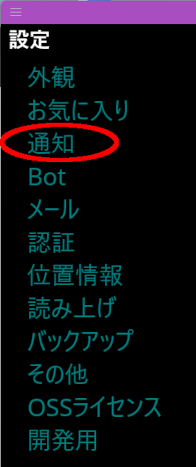
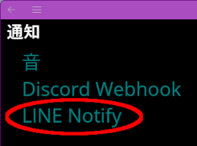
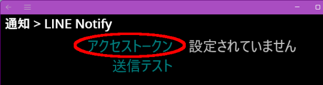
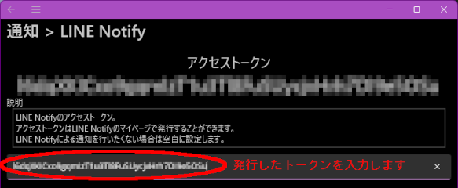
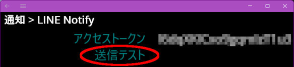
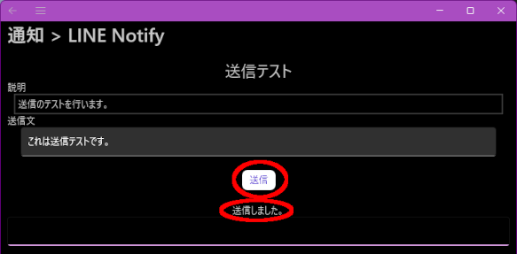

---
title: 通知をLINEで受信する
description: 俺モニターからの通知をLINEで受信するための手順を説明します。
---

目次

1. [はじめに](#introduction)
1. [LINE Notifyサイトでの手順](#linenotify)
1. [俺モニターでの手順](#oremonitor)

---

# はじめに
**俺モニター**からの通知をLINEで受信できるようにするために、**LINE Notify**を利用します。

大まかな手順の流れです。

1. LINE Notifyのアクセストークンを発行する
1. LINEグループに通知する場合はLINE NotifyアカウントをLINEグループに追加する
1. **俺モニター**にアクセストークンを登録する

---

# LINE Notifyサイトでの手順
手順が書かれたページを見つけましたので、[こちらページ](https://web.joho.info/alert/line-notify-access-token/)に従って、次のことを実施します。

1. アクセストークンを発行する（その際に通知先を選択する）
1. 通知先にLINEグループを選択した場合は、LINEアプリに戻ってLINEグループに「LINE Notify」アカウントを友だちに追加する

---

# 俺モニターでの手順

「送信」ボタンを押すと、LINE Notifyからメッセージが届くはずです。

